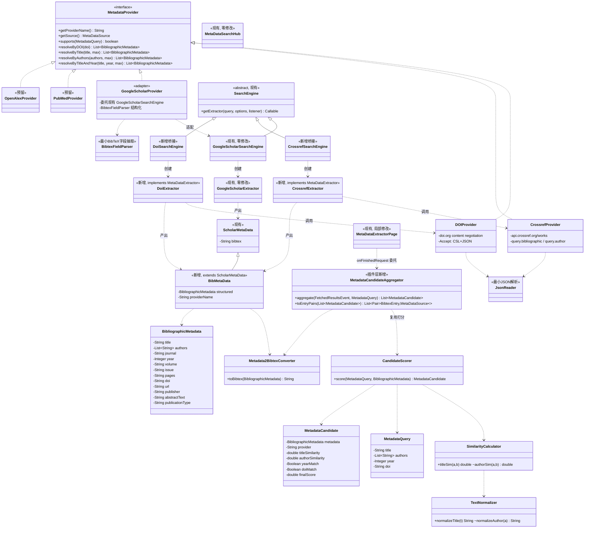

# Docear 文献元数据获取架构升级设计 —— Metadata Provider 架构

> 设计依据：`docs/metadata-retrieval-analysis.md`（2026-09-02 完成的现状分析）
> 设计日期：2026-09-02
> 性质：**纯设计文档，未修改任何 Java 源代码**
> 状态：**待确认** —— 用户确认后方可进入编码阶段

---

## 〇、设计总纲（先看这个）

### 约束复述

| # | 约束 | 设计应对 |
|---|---|---|
| 1 | 不删除现有 Google Scholar 功能 | GS 引擎/解析器/验证码流程**一行不改**，新架构与其并列共存 |
| 2 | 不改变 Docear Reference 数据结构 | 最终落库对象仍是 `net.sf.jabref.BibtexEntry` → `BibtexDatabase`，新结构化模型仅在中间层存在 |
| 3 | 不修改 MindMap / PDF Viewer / Annotation 模块 | 标题提取继续调用 `AnnotationController.getDocumentTitle()`（只调用不修改）；DOI 来源只用 XMP 数据 + 用户输入，**不触碰** pdfutilities 源码 |
| 4 | 最小侵入式修改 | 复用现有扩展点：`SearchEngine` 工厂、`MetaDataSearchHub` 注册表、`ScholarMetaData` 继承链。见"修改类列表"——插件层仅改 3 个类的局部 |
| 5 | "Create or Update Reference" 操作方式不变 | 向导、页面流转、菜单、快捷键全部不动；用户感知的唯一变化 = 候选列表可能多来源、按相关度排序 |

### 一句话架构

**在 `docear_metadata` 库内新增一个与现有引擎并列的 Provider 层（结构化模型 + 四类查询接口 + 候选打分），在插件层新增一个聚合器统一收集 Google Scholar 旧结果与新 Provider 结果，全部转成 BibTeX 走现有 `BibtexParser → BibtexEntry → BibtexDatabase` 下游链路。**

```
                    ┌─────────────────────────────────────────────┐
                    │  UI（不变）                                    │
                    │  AddNewReferenceAction → Wizard → MetaData…  │
                    └───────────────────┬─────────────────────────┘
                                        │ 注册/回调（小改）
          ┌─────────────────────────────┼─────────────────────────────┐
          │                             │                             │
   ┌──────▼──────┐              ┌───────▼───────┐             ┌───────▼───────┐
   │ GS 现有链路   │              │  新 Provider 层 │             │ (未来)         │
   │ (零修改)      │              │  DOI/Crossref  │             │ PubMed/OpenAlex│
   └──────┬──────┘              └───────┬───────┘             └───────────────┘
          │ ScholarMetaData             │ BibMetaData(结构化+BibTeX)
          └──────────────┬──────────────┘
                         ▼
            MetadataCandidateAggregator（插件层新增）
            统一打分 → 排序 → DOI 去重
                         │ List<Pair<BibtexEntry, MetaDataSource>>
                         ▼
            BibtexParser（现有）→ BibtexEntry → 入库（现有，零修改）
```

---

## 一、总体架构设计

### 1.1 分层

| 层 | 位置 | 内容 | 改动性质 |
|---|---|---|---|
| **L1 UI/编排层** | `docear_plugin_bibtex` | 向导、页面、选项 | 局部修改（3 个类）+ 新增 1 个聚合器 |
| **L2 调度层** | `docear_metadata` | `MetaDataSearchHub`（现有，不改）、新 `XxxSearchEngine` 桥接类 | 新增 |
| **L3 Provider 层** | `docear_metadata` `providers/` | `MetadataProvider` 接口 + DOI/Crossref/(GS 适配) 实现 | 新增 |
| **L4 领域模型层** | `docear_metadata` `model/` | `BibliographicMetadata`、`MetadataCandidate`、`MetadataQuery` | 新增 |
| **L5 匹配/工具层** | `docear_metadata` `match/`、`io/` | 文本归一化、相似度、打分、最小 JSON/BibTeX 解析、BibTeX 生成 | 新增 |
| **L6 下游消费层** | JabRef fork + `JabRefCommons` | `BibtexParser`、`BibtexEntry`、入库、PDF 关联、key 生成 | **零修改** |

### 1.2 关键设计决策（D1–D8）

**D1 — 新代码全部落在 `docear_metadata` 库的新包中，现有类零修改。**
`org.docear.metadata` 新增 `providers/`、`model/`、`match/`、`io/` 四个包，与现有 `engines/`、`extractors/`、`data/`、`events/` 并列。Google Scholar 的 `GoogleScholarSearchEngine`、`GoogleScholarExtractor`、`HtmlDataExtractor`、`ScholarMetaData` 原样保留并继续服役。

**D2 — 新 Provider 通过"每 Provider 一个 SearchEngine 桥接类"接入现有 `MetaDataSearchHub`。**
`MetaDataSearchHub` 以 `Class → SearchEngine` 注册、线程池调度、`asyncSearch` 异步回调——这套基建完全够用，不重写。由于 hub 按 Class 作 key（`Map<Class<?>, SearchEngine>`），每个新 Provider 各配一个薄桥接引擎：`CrossrefSearchEngine`、`DoiSearchEngine`（各约 20 行）。这与现有 `GoogleScholarSearchEngine` 的注册模式完全一致。

**D3 — 统一结构化模型 `BibliographicMetadata` 是中间层对象，不是存储对象。**
解决现状"所有字段打包在 BibTeX 字符串里、无法打分/去重/校验"的问题。但它**只在检索→候选阶段存活**：一旦用户选定候选，照旧经 `Metadata2BibtexConverter` → `BibtexParser` → `BibtexEntry` 入库。Reference 数据结构（`.bib` / `BibtexEntry`）分毫不动。

**D4 — `BibMetaData extends ScholarMetaData`，保持下游 instanceof 兼容。**
新 Provider 的结果载体继承 `ScholarMetaData`（`getBibtex()` 返回由 converter 生成的合法 BibTeX），并附加 `BibliographicMetadata` 结构化引用。插件层回调中唯一的一处类型过滤从 `source instanceof ScholarSource` 放宽为 `result instanceof ScholarMetaData`（一行），GS 旧结果与新结果即走同一条 `BibtexParser` 通道。**不选**"新 Provider 直接返回 `ScholarMetaData`"方案——那会丢失结构化字段，无法支撑 `MetadataCandidate` 打分。

**D5 — 依赖方向铁律：`docear_metadata` 不得引用 JabRef / 插件类。**
metadata 库在插件 classpath 上是个普通 jar（非 OSGi bundle），但它无法看见 `net.sf.jabref.*`。因此：
- BibTeX **解析**（用于 GS 结果结构化）：库内自写最小 `BibtexFieldParser`；
- BibTeX **生成**：库内自写 `Metadata2BibtexConverter`；
- 完整 BibTeX → `BibtexEntry` 的权威解析仍由**插件层**的 JabRef `BibtexParser` 完成（现有行为）。
打分发生在插件层聚合器内（此时 `BibtexEntry` 与 `BibliographicMetadata` 都可见），打分算法本体（纯字符串运算）放在库的 `match/` 包。

**D6 — 零新增依赖。**
不升级 jsoup 1.7.3、不引入 JSON 库。Crossref REST API 与 doi.org 的 CSL-JSON 响应用自写的最小 `JsonReader`（纯 Java，约 200 行，支持对象/数组/字符串/数字/布尔/null，Java 1.6 语法）解析。HTTP 继续用 jsoup `Connection`（`ignoreContentType(true)` 抓 JSON）。

**D7 — Google Scholar 在第一阶段保留原注册路径。**
`GoogleScholarProvider` 作为薄适配器存在（把 `ScholarMetaData.bibtex` 解析为 `BibliographicMetadata`，供聚合器打分），但 GS 的检索仍走现有 `GoogleScholarSearchEngine` 注册 + `setupSources()` 勾选，**不改其调用方式**。这样验证码流程、cookie 管理、403 重试等脆弱逻辑零风险。（是否在第二阶段把 GS 也收敛到统一 Provider 注册，见"待确认决策点 B"。）

**D8 — 打分只影响排序与展示，不自动选定。**
`MetadataCandidate.finalScore` 用于候选排序（替代现状"按返回顺序 + 默认预选第一条"），用户仍需肉眼确认后点 OK——这既改善了匹配体验，又不引入"自动选错"的合规风险（实验室场景下误配文献比多看一眼更糟）。

### 1.3 统一查询接口的落位

`MetadataProvider` 的四个 resolve 方法与实际触发的映射：

| 接口方法 | 第一阶段触发来源 | 说明 |
|---|---|---|
| `resolveByTitle(String title, int max)` | 向导默认路径：PDF 标题 / 文件名 / 用户手输 | Crossref `query.bibliographic`；GS 现有 `q=` 查询 |
| `resolveByDOI(String doi)` | ① XMP 元数据中的 DOI（`readXmpData` 已在向导中读取）② 用户在搜索框直接粘贴 DOI（正则识别 `10.\d+/...`）| doi.org content negotiation（CSL-JSON）→ Crossref `/works/{doi}` |
| `resolveByAuthors(List<String>, int max)` | 第一阶段仅实现接口（Crossref `query.author`），**UI 不暴露** | 为 PubMed/OpenAlex 阶段预留 |
| `resolveByTitleAndYear(String, int, int max)` | 同上，Crossref `query.bibliographic + filter=from-pub-date` | 预留 |

> 说明：DOI 的发现**不**做 PDF 全文扫描——那需要调用/修改 pdfutilities 的文本提取（约束 3 禁区）。XMP + 用户输入已覆盖绝大多数有 DOI 的场景。

---

## 二、类图



---

## 三、新增类列表

### 3.1 `docear_metadata` 库（Maven，新增 4 个包 15 个类/接口）

所有新代码遵守 **Java 1.6 语法**（无 diamond `<>`、无 lambda、无 try-with-resources、无 `String.join`），Maven 编译目标与现有 pom 一致。

#### `org.docear.metadata.providers`（Provider 层）

| 类 | 文件路径（新建） | 职责 |
|---|---|---|
| `MetadataProvider`（接口） | `docear_metadata/src/main/java/org/docear/metadata/providers/MetadataProvider.java` | 统一查询契约：`resolveByDOI / resolveByTitle / resolveByAuthors / resolveByTitleAndYear`，全部返回 `List<BibliographicMetadata>`；`getProviderName()`（UI 标签）、`getSource()`（返回各自 `MetaDataSource` 实现）、`supports(MetadataQuery)`（能力协商，如 GS 不支持按 DOI） |
| `DOIProvider` | `.../providers/DOIProvider.java` | doi.org content negotiation：`GET https://doi.org/{doi}`，`Accept: application/vnd.citationstyles.csl+json` → CSL-JSON → `BibliographicMetadata`。单结果精确解析，是打分体系中 `doiMatch=true` 的权威来源 |
| `CrossrefProvider` | `.../providers/CrossrefProvider.java` | `GET https://api.crossref.org/works?query.bibliographic={title}&rows={max}&select=DOI,title,author,container-title,issued,volume,issue,page,publisher,URL,abstract,type` → JSON → `List<BibliographicMetadata>`；按相关度由 Crossref 排序返回 |
| `GoogleScholarProvider`（适配器） | `.../providers/GoogleScholarProvider.java` | **不发起检索**（检索仍由现有引擎走原路径）。职责：把现有链路产出的 `ScholarMetaData.bibtex` 经 `BibtexFieldParser` 转成 `BibliographicMetadata`，供聚合器统一打分。实现 `MetadataProvider` 接口使其在未来可整体替换注册方式 |
| `PubMedProvider` / `OpenAlexProvider` | 预留占位（第一阶段不建文件，仅在接口 javadoc 中登记扩展方式） | 第二阶段实现 |

#### `org.docear.metadata.model`（领域模型层）

| 类 | 职责 |
|---|---|
| `BibliographicMetadata` | 统一结构化元数据 POJO：`title, authors(List<String>), journal, year(Integer), volume, issue, pages, doi, url, publisher, abstractText, publicationType(article/incollection/proceedings...)`。纯 getter/setter，无外部依赖 |
| `MetadataQuery` | 查询上下文（输入侧）：`title, authors, year, doi`。从 PDF 标题 + XMP + 用户输入组装，传给打分器作为"期望值" |
| `MetadataCandidate` | 候选结果（输出侧）：`metadata, provider, titleSimilarity(double 0–1), authorSimilarity(double 0–1), yearMatch(Boolean/null), doiMatch(Boolean/null), finalScore(double)`。实现 `Comparable<MetadataCandidate>` 按 finalScore 降序 |

#### `org.docear.metadata.match`（匹配/打分层）

| 类 | 职责 |
|---|---|
| `TextNormalizer` | 标题清洗（现状完全缺失的能力）：折叠空白、去除连字符/标点差异、大小写归一、去除常见尾缀（"a study of"等虚词权重处理在打分器）。`normalizeAuthor()` 处理 "Family, Given" vs "Given Family" |
| `SimilarityCalculator` | token 集合 Jaccard + 归一化 Levenshtein 的混合标题相似度；作者集合的加权重合度。纯静态方法，可单测 |
| `CandidateScorer` | 打分编排：`score(MetadataQuery q, BibliographicMetadata m, String provider) → MetadataCandidate`。权重常量：`titleSimilarity 0.5 / authorSimilarity 0.2 / yearMatch 0.15 / doiMatch 0.15`（常量集中定义，后续可经 options 覆盖） |

#### `org.docear.metadata.io`（解析/序列化层）

| 类 | 职责 |
|---|---|
| `JsonReader` | 最小 JSON 解析器（Java 1.6，零依赖）：支持对象/数组/字符串（含转义）/数字/布尔/null，产出 `Map<String,Object>` / `List<Object>` 树。仅供 Crossref/DOI 的响应解析，**不追求完整 JSON 规范**，解析失败抛 `IOException` 由 extractor 现有 catch 兜底 |
| `BibtexFieldParser` | 最小 BibTeX 字段抽取：解析 `@type{key, field={value}, ...}`，处理花括号嵌套与 `"..."` 值。用于 GoogleScholarProvider 把 GS 的 BibTeX 转结构化（只读字段，不重建 entry） |
| `Metadata2BibtexConverter` | `BibliographicMetadata` → 合法 BibTeX 字符串（`@article{..., title={...}, ...}`），负责花括号转义、`publicationType → entry type` 映射、字段缺省省略。产物喂给 `BibMetaData.getBibtex()`，从而走现有 `BibtexParser` 下游 |

#### `org.docear.metadata.adapter`（桥接/兼容层）

| 类 | 职责 |
|---|---|
| `BibMetaData extends ScholarMetaData` | 新 Provider 的结果载体：继承 `getBibtex()`（构造时由 converter 生成），新增 `getStructured()`（BibliographicMetadata）与 `getProviderName()`。**兼容性核心**：`instanceof ScholarMetaData` 成立，下游解析链零修改 |
| `CrossrefSearchEngine extends SearchEngine` | 桥接：`getExtractor()` 依据 `CommonConfigKeys.MAXRESULTS/TIMEOUT` 构造 `CrossrefExtractor`（约 20 行） |
| `DoiSearchEngine extends SearchEngine` | 桥接：从 query 串中识别 DOI（或经 options 传入），构造 `DoiExtractor` |
| `CrossrefExtractor implements MetaDataExtractor` | `call()`：调 `CrossrefProvider.resolveByTitle()` → 逐条 `new BibMetaData(...)` → `fire FetchedResultsEvent`。异常处理沿用现有模式（catch IOException → log → fire 空结果事件，保证"Finished x of N"计数不悬挂） |
| `DoiExtractor implements MetaDataExtractor` | 同上，调 `DOIProvider.resolveByDOI()`。无 CAPTCHA 分支（学术 API 不需要） |

### 3.2 `docear_plugin_bibtex` 插件（新增 1 个类）

| 类 | 文件路径（新建） | 职责 |
|---|---|---|
| `MetadataCandidateAggregator` | `docear_plugin_bibtex/src/org/docear/plugin/bibtex/dialogs/MetadataCandidateAggregator.java` | 聚合与统一出口：`aggregate(FetchedResultsEvent, MetadataQuery)` 把事件里的 `MetaData` 归一为候选——`ScholarMetaData`(GS)：`BibtexParser` 解析（复用现有代码）→ 从 `BibtexEntry` 字段抽 title/author/year → `CandidateScorer` 打分；`BibMetaData`(新)：直接取 `getStructured()` 打分。随后 `dedupeByDOIOrTitle()`、按 `finalScore` 排序、`toEntryPairs()` 产出 `List<Pair<BibtexEntry, MetaDataSource>>` 供现有 `listModelFetchedResults.addEntries()`。**把本属于页面的业务逻辑从 `MetaDataExtractorPage` 中抽出，页面类改动因此缩到最小** |

---

## 四、修改类列表（全部为局部修改）

| # | 类 | 文件路径 | 修改点 | 预估规模 |
|---|---|---|---|---|
| 1 | `MetaDataExtractorPage` | `docear_plugin_bibtex/src/.../dialogs/MetaDataExtractorPage.java` | ① `preparePage()` L541 附近：在现有 `registerSearchEngine(new GoogleScholarSearchEngine(null))` 之后**追加**注册 `CrossrefSearchEngine`、`DoiSearchEngine`（不删 GS）；② `setupSources()` L438-448：按新选项 key 追加勾选逻辑；③ `onFinishedRequest()` L384-399：`source instanceof ScholarSource` → `result instanceof ScholarMetaData`，事件处理体委托给 `MetadataCandidateAggregator`，列表填充由"按 rank 顺序"改为"按 finalScore 排序" | ~40 行 |
| 2 | `MetaDataOptionsPage` | `docear_plugin_bibtex/src/.../dialogs/MetaDataOptionsPage.java` | 新增三个选项：`docear_metadata_searchCrossref`（勾选框）、`docear_metadata_searchDOI`（勾选框）、`docear_metadata_timeout`（spinner，毫秒，替代现状"永不配置的硬编码 3000"） | ~30 行 |
| 3 | `ReferencesController` | `docear_plugin_bibtex/src/.../ReferencesController.java` | `setDefaultProperty` 注册上述三个 key 的默认值（`searchCrossref=true, searchDOI=true, timeout=10000`） | ~5 行 |
| 4 | `Resources_en.properties`（+其他语言文件） | `docear_plugin_bibtex/resources/` | 新选项的 i18n 文案；候选列表来源标签（"Google Scholar" / "Crossref" / "DOI"） | 文案若干 |
| 5 | **构建产物**（非源码） | `docear_plugin_bibtex/lib/docear-metadata-lib-0.0.1.jar` | Maven 重建 `docear_metadata` → 覆盖该 jar。Ant 主构建不变（它只打包预置 jar）。此为每次改动 metadata 库后的固定手工步骤，写入 README 说明 | 0 行代码 |

> 不修改：`AddNewReferenceAction`、`AddOrUpdateReferenceEntryWorkspaceAction`、`MetaDataAction`、`JabRefCommons`、`MetaDataSearchHub`、`SearchEngine`、`HtmlDataExtractor`、`GoogleScholarSearchEngine`、`GoogleScholarExtractor`、`ScholarMetaData`、`CaptchaRequestDialog`、JabRef fork 全部、Freeplane 核心、`AnnotationController`、所有 OSGi manifest、所有 build.xml。

---

## 五、每个类的职责与现有类的关系（汇总矩阵）

| 新类 | 依赖的现有类 | 被谁使用 | 替代/扩展了什么 |
|---|---|---|---|
| `MetadataProvider` 接口 | `MetaDataSource` | 各 Provider 实现 | 扩展 `SearchEngine`（检索工厂）——Provider 面向**领域查询**，Engine 面向**调度桥接**，两者经桥接类衔接而非合并 |
| `DOIProvider` / `CrossrefProvider` | `JsonReader`（新）、jsoup `Connection` | `DoiExtractor` / `CrossrefExtractor` | 与 `GoogleScholarExtractor` 并列的取数实现（API 型 vs 网页抓取型） |
| `GoogleScholarProvider` | `GoogleScholarSearchEngine`（只读复用）、`BibtexFieldParser` | `MetadataCandidateAggregator` | 适配器：让 GS 结果获得与新 Provider 同构的结构化视图 |
| `BibliographicMetadata` | 无 | Provider 层、聚合器 | 填补 `ScholarMetaData`（仅 bibtex 字符串）缺失的结构化层 |
| `MetadataCandidate` | `BibliographicMetadata` | 聚合器、UI | 替代现状"rank + 默认预选第一条"的原始排序 |
| `MetadataQuery` | 无 | 聚合器 → 打分器 | 把现状"裸 title 字符串 query"升级为带上下文（year/doi）的查询对象 |
| `CandidateScorer` / `SimilarityCalculator` / `TextNormalizer` | 无（纯 Java） | 聚合器 | 全新能力：现状完全没有标题清洗与匹配打分 |
| `JsonReader` | 无 | DOI/Crossref Provider | 零依赖替代 JSON 库（约束：不升级依赖） |
| `BibtexFieldParser` | 无 | GoogleScholarProvider | 轻量替代在库内调用 JabRef `BibtexParser`（依赖方向不允许） |
| `Metadata2BibtexConverter` | 无 | `BibMetaData` 构造 | 让结构化模型"降级"回现有 BibTeX 通道的转接头 |
| `BibMetaData` | `ScholarMetaData`（继承）、`MetaData`（间接） | 新 Extractor 产出、聚合器消费 | 兼容层：使新结果通过 `instanceof ScholarMetaData` 走现有下游 |
| `CrossrefSearchEngine` / `DoiSearchEngine` | `SearchEngine`（继承） | `MetaDataSearchHub.registerSearchEngine()`（现有注册 API） | 与 `GoogleScholarSearchEngine` 同构的注册单元 |
| `CrossrefExtractor` / `DoiExtractor` | `MetaDataExtractor`（接口）、`FetchedResultsEvent`（现有事件） | hub 线程池 `Callable` 调度 | 与 `GoogleScholarExtractor` 同构的执行单元；不需要 CAPTCHA 分支 |
| `MetadataCandidateAggregator` | `BibtexParser`（JabRef，插件层可见）、`CandidateScorer`、`Metadata2BibtexConverter` | `MetaDataExtractorPage.onFinishedRequest()` | 把原本内联在匿名 `MetaDataListener` 里的结果处理逻辑抽出并增强 |

---

## 六、可复用代码清单

| 现有资产 | 复用方式 |
|---|---|
| `MetaDataSearchHub`（注册表 + 线程池 + asyncSearch + listener 包装） | **原样使用**。新引擎 `registerSearchEngine()` 即入池 |
| `SearchEngine` 抽象基类 | 原样继承（`CrossrefSearchEngine` 等） |
| `MetaDataExtractor` 接口 + `FetchedResultsEvent`/`MetaDataListener` 事件体系 | 原样实现/复用，包括 `requestCount` 依赖的"每引擎恰 fire 一次"约定 |
| `ScholarMetaData` 继承链 + 插件层 `BibtexParser` 调用 | 经 `BibMetaData` 继承原样复用整个下游 |
| `HtmlDataExtractor`（UA/referrer/timeout/cookie） | GS 继续使用；新 Extractor **不继承**（无需 cookie/验证码，直接用 jsoup `Connection`，行为更简单）但复用其配置键语义（`CommonConfigKeys.TIMEOUT/MAXRESULTS`） |
| `CommonConfigKeys.TIMEOUT` | 从"从未被 UI 传入"变为经 `setupSearchOptions()` 真正生效（对 GS 也同步受益） |
| `AnnotationController.getDocumentTitle()` | 原样调用（约束 3：只调用不修改） |
| `readXmpData` + `PdfXmpImporter` | 原样调用，作为 DOI 发现来源之一 |
| `MetaDataOptionsPage` 的选项框架 / `ReferencesController.setDefaultProperty` 模式 | 沿用现有 key 命名与注册惯例（`docear_metadata_*`） |
| Wizard / `MetaDataAction` / `JabRefCommons` 全部下游 | 零改动复用 |

---

## 七、必须重构的代码（范围严格受限）

| 重构点 | 原因 | 替代方案（若不重构则…） |
|---|---|---|
| `onFinishedRequest()` 的 `source instanceof ScholarSource` 过滤（1 行） | 该过滤会把新 Provider 的 `BibMetaData` 结果**静默丢弃**（其 source 是新枚举，不是 `ScholarSource`） | 无法交付——这是新结果进入 UI 的唯一闸口 |
| `onFinishedRequest()` 的结果填充逻辑（约 15 行内联代码） | 需插入打分/排序/去重；顺带把这段业务逻辑抽到 `MetadataCandidateAggregator`，页面类回归纯 UI | 若坚持内联，`MetaDataExtractorPage` 单方法将膨胀到 100+ 行，违背最小侵入的可维护性初衷 |
| `setupSources()` / `preparePage()` 的引擎装配（各 2–3 行） | 从"硬编码单引擎"到"按配置装配多引擎" | 无——这正是本项目的接线点 |
| `searchMetadata()` 的 `searchValue.equals(...)` 过期请求判断 | 保留原样（不复用其语义给新 Provider 的并发去重——聚合器按 DOI/标题去重更可靠） | 不重构则并发多引擎下过期请求过滤依赖 query 字符串相等，用户改词瞬间会产生竞态（现状已有此问题，本次不扩大也不修复——见风险 R10） |

**刻意不重构**（保持约束 4 的克制）：`GoogleScholarExtractor` 的验证码/403/cookie 流程、`MetaDataSearchHub` 的静态线程池、`searchMetadata()` 的防重搜逻辑、`HtmlDataExtractor` 超时硬编码（改为经 config 传入是顺手收益，不算重构）。

---

## 八、潜在兼容性风险

| # | 风险 | 等级 | 缓解 |
|---|---|---|---|
| R1 | **`instanceof ScholarSource` 单点**：漏改此行则新 Provider 结果全部静默丢失，且无报错 | 高 | 设计已列为必须修改项 #1；集成测试用例必须包含"仅启用 Crossref 也能出结果" |
| R2 | **`requestCount >= registeredEngines.size()` 完成计数**：若某新引擎异常路径不 fire `FetchedResultsEvent`，spinner 永不消失 | 高 | 新 Extractor 的 catch 块必须 fire 空结果事件（沿用 `GoogleScholarExtractor` 的既有模式）；聚合器增加超时兜底显示 |
| R3 | **3 秒超时对 API 不够**：现状硬编码 3000ms，Crossref 冷启动常超 3s | 中 | 新增 `docear_metadata_timeout` 选项并经 `CommonConfigKeys.TIMEOUT` 下发（GS 同步受益）；默认 10000ms |
| R4 | **Java 1.6 语法约束**：metadata 库编译目标是老版本，新代码误用 diamond/lambda 会直接编译失败 | 中 | 编码规约写入本文档；每类提交前 `mvn compile` 验证 |
| R5 | **jsoup 1.7.3 抓 JSON**：默认按 HTML contentType 会拒绝；HTTPS/TLS 对 JDK8 无碍但需 `ignoreContentType(true)` | 中 | 在 Provider 层统一封装连接构造；在真实网络下冒烟测试 Crossref |
| R6 | **多引擎候选总量膨胀**：`maxResults`（默认 3）为每引擎各自上限，3 引擎最多 9 条候选，UI 列表变长 | 低 | 聚合器全局截断（如上限 10）+ 按 finalScore 排序后截断，属产品参数可调 |
| R7 | **跨 Provider 重复**：DOI Provider 与 Crossref 对同一论文会各出一条（内容一致） | 低 | 聚合器按归一化 DOI 去重，其次按归一化标题+年份去重；保留得分高/字段全者 |
| R8 | **GS 适配解析脆弱**：`BibtexFieldParser` 遇非标准 BibTeX（`#` 拼接、跨行注释）可能解析失败 | 低 | 失败时降级：该候选 `titleSimilarity=-1`（排最后）而非丢弃；原始 BibTeX 仍完整保留给下游 |
| R9 | **XStream cookie 文件与新引擎无冲突**：新引擎不持久化 cookie，`COOKIE_FOLDER` 键被无视 | 无 | 仅确认，无需动作 |
| R10 | **过期请求竞态**（现状已有）：用户改搜索词瞬间，旧引擎回调仍会到达 | 低 | 沿用现状 `searchValue.equals(result.getQuery())` 过滤（所有引擎的 query 都是同一字符串，天然覆盖新引擎）；不修复既有缺陷，只保证不恶化 |
| R11 | **静态线程池增长**：每引擎一个 Callable，并发量 = 引擎数（3），远低于池上限（∞） | 无 | 现状已如此，本次不扩大 |
| R12 | **OSGi classloading**：`docear_metadata` jar 在插件 classpath 上（非 bundle），新增类不涉及 manifest 变更；但**新类若引用插件层类型会 NoClassDefFoundError** | 中 | 依赖方向铁律（D5）已禁止；code review 检查项 |
| R13 | **在线服务可用性**：docear.org 已死但与本链路无关；Crossref/doi.org 需外网可达（用户已有代理环境，java 进程需 `-Dhttp.proxyHost` 或系统代理——若直连失败属环境问题而非代码问题） | 低 | README 记录代理配置说明 |

---

## 九、第一阶段实施范围与构建流程

**实现**：`DOIProvider`、`CrossrefProvider`、`GoogleScholarProvider`（适配）+ 全部支撑类（模型/打分/解析/桥接）+ 聚合器 + 3 个既有类的局部修改。

**不实现**（接口已预留）：`PubMedProvider`、`OpenAlexProvider`、`resolveByAuthors/resolveByTitleAndYear` 的 UI 触发。

**构建闭环**（每次迭代）：

```
1. cd docear_metadata && mvn clean package        # Maven 编译新库
2. cp target/docear-metadata-lib-*.jar  \
     ../docear_plugin_bibtex/lib/docear-metadata-lib-0.0.1.jar   # 覆盖预置 jar
3. bash tools/docear-build.sh build               # Ant 主构建（不变）
4. tools/run-docear.cmd                           # 冒烟验证
```

（第 2 步的 jar 文件名如带 SNAPSHOT 需保持与 lib 下引用名一致，必要时保留原文件名。）

**验收标准**（建议）：
- 仅勾选 Google Scholar → 行为与现状逐像素一致（回归）
- 仅勾选 Crossref → 按标题出候选，带来源标签与相关度排序
- 粘贴 DOI 或 XMP 含 DOI → DOI 精确解析出完整条目
- 三引擎同开 → 候选合并、去重、按 finalScore 排序
- 断网 → 各引擎均优雅降级，spinner 正常消失（R2）

---

## 十、待确认决策点（编码前需要你拍板）

| # | 决策 | 选项 | 本设计的倾向 |
|---|---|---|---|
| A | Crossref JSON 解析方式 | (1) 自写最小 `JsonReader`（零依赖，可解析完整检索结果）(2) 只用 doi.org content negotiation 拿 BibTeX（零解析代码，但**不支持**标题模糊检索，CrossrefProvider 退化为 DOI 查询）(3) 引入 JSON 库（违反"不升级依赖"） | **(1)** |
| B | Google Scholar 的接入方式 | (1) 保留现有引擎注册路径，`GoogleScholarProvider` 仅做结果适配（本设计）(2) GS 也统一走 Provider 注册（改动更大，验证码/cookie 逻辑需搬家） | **(1)** |
| C | 打分权重 | title 0.5 / author 0.2 / year 0.15 / doi 0.15 | 可调，先按此实现并暴露为常量 |
| D | 候选列表 UI | (1) 仅排序 + 现有来源标签（2) 追加显示 finalScore 百分比 | **(1)** 起步，(2) 可选 |
| E | 默认启用状态 | Crossref/DOI 默认开（推荐，因为 GS 大概率已被 Google 页面改版废掉）或默认关（最保守回归） | 默认开，但选项可关 |

---

*本文档为设计稿，尚未修改任何 Java 源代码、依赖或构建脚本。待用户确认后进入编码阶段。*
